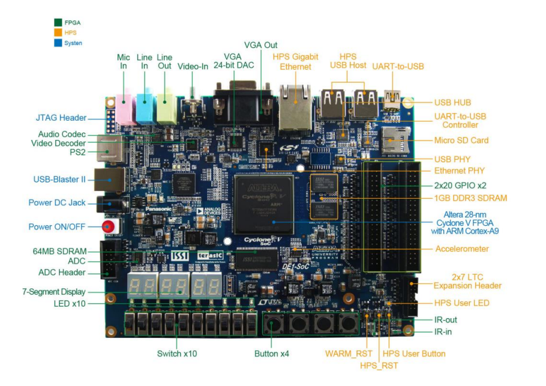
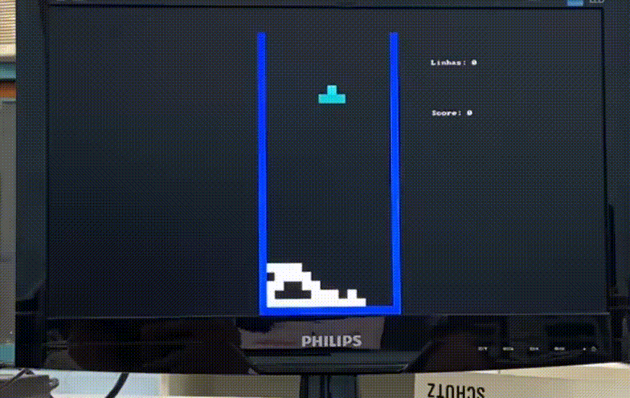
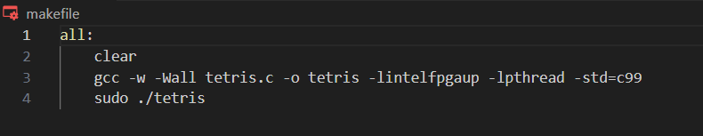

---

## **Contexto do Projeto**

O projeto proposto consiste no desenvolvimento de um jogo inspirado no clássico Tetris, utilizando a plataforma de hardware DE1-SoC. O objetivo é aplicar os conhecimentos de integração entre hardware e software para criar um jogo funcional, onde o movimento do jogador será controlado pelo acelerômetro integrado na placa, ao invés dos controles tradicionais. O projeto visa, ainda, ensinar a programação em C para um processador de arquitetura ARM e o uso das interfaces de hardware disponíveis, como botões, chaves, LEDs, displays de 7 segmentos e a interface VGA para visualização do jogo em um monitor.

O projeto apresenta desafios como a necessidade de não utilizar bibliotecas específicas para o acelerômetro, fazendo com que os alunos precisem implementar o controle do sensor diretamente. O código deve ser escrito em linguagem C e todo o desenvolvimento deve ser compatível apenas com os componentes disponíveis na placa DE1-SoC, reforçando o aprendizado prático da plataforma e do desenvolvimento em baixo nível. Por fim, o projeto será entregue via repositório no GitHub, com uma documentação detalhada, incluindo o código, scripts de compilação e os testes realizados​.

---

  

---

## **Objetivos de Aprendizagem**
Ao final deste projeto, o/a discente será capaz de:

1. **Aplicar conhecimentos de interação hardware-software para desenvolver um jogo funcional;**
2. **Programar em C para um processador com arquitetura ARM;**
3. **Compreender políticas de gerenciamento do sistema operacional Linux na arquitetura ARM;**
4. **Entender os princípios básicos da arquitetura da plataforma DE1-SoC;**
5. **Utilizar as interfaces disponíveis na placa DE1-SoC.**

---

## **Requisitos**

1. **O código deve ser escrito em C;**
2. **O sistema deve usar apenas os componentes disponíveis na placa;**
3. **Não é permitido o uso de bibliotecas para o acelerômetro;**
4. **O jogo deve pontuar e eliminar agrupamentos.**

---
## **Software Utilizados**

<code></code>
<code></code>
<code></code>
<code></code>

### GNU/Linux
Por fim, o kit de desenvolvimento DE1-SoC possui uma distribuição do Linux embarcado instalada, possibilitando a comunicação com o kit bem como a execução dos códigos criados através de conexão remota. Isso oferece uma gama de possibilidades para a elaboração do problema: a disposição dos diretórios do sistema e a possibilidade de compilar códigos na linguagem de programação requisitada de forma fácil com o compilador gcc embarcado no kit de desenvolvimento foram fundamentais.

### VS Code
O Visual Studio Code (VS Code) é uma ferramenta popular e altamente funcional utilizada em uma variedade de projetos de desenvolvimento de software. O uso dele foi necessário para agilizar o desenvolvimento, permitindo editar, depurar e gerenciar o código de maneira simplificada e eficaz.

### C
A linguagem C é amplamente utilizada em projetos devido à sua eficiência e versatilidade. Com sua sintaxe direta e controle próximo sobre o hardware, o C permite desenvolver programas robustos e rápidos, especialmente em sistemas embarcados, drivers de dispositivos e software de baixo nível. No contexto deste projeto, a utilização da linguagem C foi um dos requisitos necessarios a serem cumpridos.

---

## **Kit de Desenvolvimento DE1-SoC**

O kit de desenvolvimento DE1-SoC é uma plataforma de prototipagem projetada para o desenvolvimento de sistemas embarcados e aplicações em FPGA (Field-Programmable Gate Array). Este kit é equipado com um FPGA da Altera (atualmente Intel), que permite a implementação de circuitos digitais personalizados. Abaixo tem os componentes principais dessa placa.

---
## **Funcionamento do Jogo**

1. Estrutura Básica do Jogo: 
O jogo é inspirado no Tetris, onde o objetivo é posicionar peças de diferentes formas para completar linhas e eliminá-las.
As peças caem automaticamente no tabuleiro, e o jogador as controla através do acelerômetro e dos botões da placa DE1-SoC.
O jogo termina quando uma nova peça não consegue ser posicionada devido à falta de espaço (Game Over).
2. Peças e Movimentação: 
O jogo tem 7 tipos de peças (formas), cada uma com uma cor e configuração específicas, representadas por matrizes 2D.
As peças caem gradualmente de cima para baixo, e o jogador pode movê-las para a esquerda ou direita com base no valor do acelerômetro.
Rotação das peças é feita com o botão 0, e a movimentação horizontal se baseia no valor de accelX, lido do acelerômetro.
As funções verificam constantemente se a nova posição da peça é válida, evitando colisões ou saídas dos limites do tabuleiro.
3. Verificação de Posições e Colisões: 
A função CheckPosition é responsável por verificar se a posição atual da peça é válida (sem sair dos limites ou colidir com outras peças).
Caso a peça colida ou saia dos limites, o jogo impede o movimento e mantém a peça na sua posição atual.
4. Atualização do Tabuleiro: 
Quando uma peça atinge o fundo do tabuleiro ou colide com outra peça, ela se torna parte permanente do array Table.
A função WriteToTable insere a peça atual no tabuleiro, fixando sua posição e permitindo que uma nova peça seja gerada.
5. Detecção e Remoção de Linhas Completas: 
A função Check_lines verifica se alguma linha foi completada (quando todas as colunas de uma linha estão preenchidas).
Se uma linha completa for detectada, ela é removida, e as linhas acima são movidas para baixo, criando espaço.
Cada linha eliminada aumenta a pontuação em 100 pontos, e a velocidade de queda das peças é aumentada conforme o número de linhas completas.
6. Controle de Queda e Atraso: 
A função fallDelay define o tempo de espera entre cada "queda" automática da peça, inicialmente em 80ms.
Esse tempo diminui conforme mais linhas são completadas, acelerando o ritmo do jogo e aumentando a dificuldade.
7. Pontuação e Exibição de Informações: 
O jogo exibe a pontuação e o número de linhas completadas diretamente na tela via interface VGA, utilizando a função video_text.
As informações são atualizadas em tempo real, assim como a visualização do tabuleiro e das peças.
8. Thread para Leitura do Acelerômetro: 
A leitura do valor do eixo X do acelerômetro é feita em uma thread separada, que atualiza o valor continuamente enquanto o jogo está em execução.
Isso permite que a movimentação das peças ocorra de forma fluida, sem interromper o fluxo principal do jogo.
9. Pause e Game Over: 
O jogador pode pausar o jogo a qualquer momento pressionando o botão 2, que exibe uma mensagem de pausa na tela e suspende o jogo até que o botão seja pressionado novamente.
Quando não há mais espaço para posicionar uma nova peça, o jogo exibe a mensagem de Game Over e termina.
10. Gerenciamento da Memória das Peças: 
As peças são geradas dinamicamente através da função CopyShape, que faz uma cópia da peça original.
Ao rotacionar ou descartar uma peça, a memória alocada é liberada usando a função DeleteShape para evitar vazamento de memória.

---
## **Testes** 
Alguns gif's abaixo descreve os testes feito durante o desenvolvimento.

### Game Over

---
### Pontuação

---
### Pause

---

## **Como executar o Jogo**

### Makefile
Este Makefile fornece uma maneira simples e eficaz de compilar e executar seu projeto de Tetris, garantindo que as dependências necessárias sejam incluídas e que o ambiente esteja limpo antes da execução. A utilização de sudo indica que a aplicação pode interagir diretamente com o hardware, o que é comum em projetos que envolvem FPGAs e sistemas embarcados.

1. all: 
Este é o alvo padrão do Makefile. Quando você executa make sem especificar um alvo, o Makefile executa o alvo all. Neste caso, não há dependências definidas, então ele sempre executará as instruções subsequentes.

2. clear: 
Este comando é utilizado para limpar a tela do terminal antes de compilar e executar o programa. Isso ajuda a manter a saída do terminal organizada e facilita a visualização dos resultados.

3. gcc -w -Wall tetris.c -o tetris -lintelfpgaup -lpthread -std=c99
Este comando utiliza o GCC (GNU Compiler Collection) para compilar o código-fonte do jogo Tetris. Vamos quebrar as opções: 

    • -w: Desativa todos os avisos durante a compilação. 
• -Wall: Ativa todos os avisos recomendados, ajudando a identificar possíveis problemas no código. 
tetris.c: Especifica o arquivo de origem a ser compilado. 
• -o tetris: Define o nome do arquivo executável resultante como tetris. 
• -lintelfpgaup: Linka a biblioteca libintelfpgaup, que pode ser necessária para interagir com o hardware do kit DE1-SoC. 
• -lpthread: Linka a biblioteca de threads POSIX (pthread), permitindo a utilização de funcionalidades de multithreading, que podem ser importantes para aplicações que requerem concorrência. 
• -std=c99: Especifica que o código deve ser compilado usando o padrão C99, que introduziu várias melhorias e funcionalidades em relação às versões anteriores do C. 
4. sudo ./tetris:  
Após a compilação bem-sucedida, este comando executa o programa resultante (tetris). O uso de sudo sugere que o programa pode precisar de permissões elevadas para acessar recursos específicos do sistema ou hardware, como acessar o FPGA no kit DE1-SoC.

### Execução do Makefile

Ao implementar o makifile, facilitou-se ativamente na execução do jogo. Segue um passo a passo de como é feito:
1. O usuário deve conectar ao kit de desenvolvimento De1-Soc;
2. Entrar no diretório onde está o projeto;
3. Escrever no terminal a palavra chave "make";
4. Digitar a senha do usuário do pc;

Desse modo, o projeto vai iniciar a execução.

---
## **Resultados Alcançados**
Apos a implementação do projeto, todos os resultados estabelecidos foram alcançados com sucesso, gerando aprendizagem e sastifação para os desenvolvedores.  
Alem disso, é possível, enquanto execução, pausar o jogo e posteriormente, após o comando, continar, e também, o usuário pode ratacionar a peça utilizando o butão 0b001 (KEY 01) da placa, gerando mais entretenimento e sastifação aos jogadores.

---
## **Conclusão**
Em suma, o projeto foi executado com sucesso. Apesar dos desafios iniciais relacionados à integração do acelerômetro, o jogo demonstrou ser funcional e atendeu aos requisitos estabelecidos. Além disso, essa experiência foi crucial para aprofundar o entendimento sobre o kit de desenvolvimento, GNU/Linux embarcado e a interação entre hardware e software. Esse conhecimento adquirido certamente enriquecerá futuros projetos a serem desenvolvidos no kit DE1-SoC.

---

## **Alunos(as)**

<table align='center'>
<tr> 
  <td align="center">
    
     <b><a href="https://github.com/LuisMarioRC">Luis Mario</a></b> 👨‍💻
  </td>
  <td align="center">
    
     <b><a href="https://github.com/laizagordiano">Laiza Gordiano</a></b> 👨‍💻
  </td>
  <td align="center">
    
     <b><a href="https://github.com/Ltiicia">Letícia Gonçalves</a></b> 👨‍💻
  </td>
</tr>

</table>

---

### **Créditos**
Este projeto foi desenvolvido na disciplina TEC499 - MI de Sistemas Digitais (Semestre 2024.2) do curso de Engenharia de Computação da Universidade Estadual de Feira de Santana - UEFS.

---

